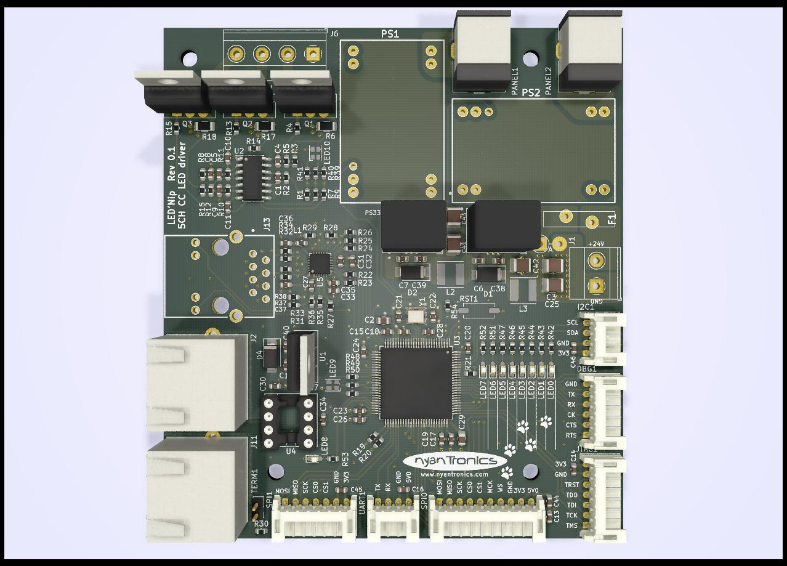

# LED'Nip #

 LED'Nip is a 5-channel Cortex-M4-based LED controller and general STM32 development board. It has the following features:

- STM32F427 microcontroller (Cortex-M4, 180 MHz).
- 100 MBit Ethernet (LAN8472A).
- CAN (RJ-45 jacks).
- Three 12V channels for RGB LED strips or similar.
- Two channels for ~25 Watt LED panels each (5.5/2.1 mm jack) with constant current regulator (1A LDD-1000H or equivalent per channel).
- 24 VDC board supply voltage.
- SPI, I2C, U(S)ART, I2S and JTAG broken out into JST PH headers.

## Status ##

The LED'Nip hardware has been mostly validated. Test firmware can be found in its folder, with the firmware and backend service that will allow for the board to be used with building lighting and similar still under development.

## Project page

A project & product page can be found at: [http://www.nyantronics.com/lednip.php](http://www.nyantronics.com/lednip.php "LED'Nip")